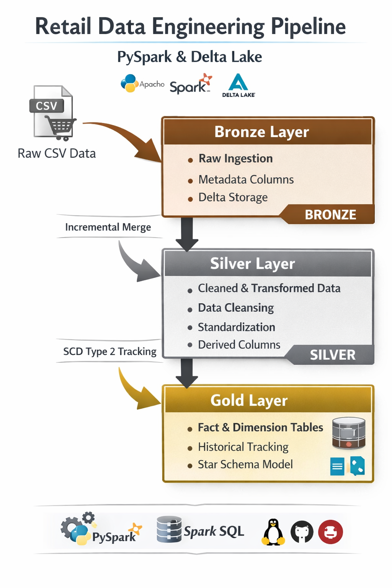

# Retail Data Engineering Pipeline

An end-to-end **Retail Data Engineering Pipeline** built with **PySpark**, **Delta Lake**, **Apache Airflow**, and **Docker**.

This project demonstrates a batch data pipeline using the **Medallion Architecture** pattern. It ingests raw retail sales data, performs incremental loading, cleans and transforms the data, tracks historical changes using SCD Type 2, and builds Gold layer fact and dimension tables for analytics.

---

## Key Features

- End-to-end PySpark ETL pipeline
- Medallion Architecture: Bronze, Silver, and Gold layers
- Delta Lake storage format
- Incremental loading using Delta merge
- SCD Type 2 historical tracking
- Gold layer star schema modeling
- Airflow orchestration with a modern decorator-based DAG
- Docker Compose setup for local execution
- PostgreSQL metadata database for Airflow
- Local Airflow task logs
- Docker-managed Delta storage volume to avoid Windows/WSL permission issues

---

## Architecture

```text
Raw Retail CSV
      |
      v
Bronze Layer
Raw ingestion, audit columns, duplicate handling
      |
      v
Incremental Merge
Updates existing records and inserts new records
      |
      v
Silver Layer
Cleaning, standardization, type casting, derived columns
      |
      v
SCD Type 2 History
Maintains active and inactive historical records
      |
      v
Gold Layer
Analytics-ready fact and dimension tables
```



---

## Tech Stack

- Python
- PySpark
- Delta Lake
- Apache Airflow
- Docker Compose
- PostgreSQL
- Spark SQL
- Linux / WSL

---

## Key Data Engineering Concepts Implemented

- Medallion Architecture
- Incremental ETL Processing
- Slowly Changing Dimension (SCD Type 2)
- Star Schema Modeling
- Workflow Orchestration
- Dockerized Data Platform
- Delta Lake ACID Transactions

---


## Project Structure

```text
data_engineering_project/
|
|-- airflow/
|   |-- dags/
|   |   |-- retail_data_pipeline_dag.py
|   |-- logs/
|
|-- data/
|   |-- retail_sales.csv
|   |-- retail_sales_incremental.csv
|
|-- spark_jobs/
|   |-- bronze_ingestion.py
|   |-- bronze_incremental_merge.py
|   |-- silver_transformation.py
|   |-- scd2_tracker.py
|   |-- gold_star_schema.py
|
|-- Dockerfile
|-- docker-compose.yml
|-- main.py
|-- requirements.txt
|-- README.md
|-- architecture.png
```

Important: when running with Docker/Airflow, Delta tables are stored inside a Docker volume mounted at:

```text
/opt/airflow/delta
```

This avoids Windows/OneDrive/WSL permission problems with Delta Lake and Hadoop file writes.

---

## Pipeline Stages

### 1. Bronze Ingestion

File:

```text
spark_jobs/bronze_ingestion.py
```

This job reads the initial raw retail sales CSV file:

```text
data/retail_sales.csv
```

It performs:

- CSV ingestion
- Column name standardization
- Required column selection
- Duplicate removal using `transaction_id`
- Audit column creation:
  - `ingestion_timestamp`
  - `source_file`

The Bronze initial load creates the table only if it does not already exist. It does not overwrite Bronze on every run.

Output:

```text
/opt/airflow/delta/bronze/retail_sales
```

---

### 2. Bronze Incremental Merge

File:

```text
spark_jobs/bronze_incremental_merge.py
```

This job reads incremental data from:

```text
data/retail_sales_incremental.csv
```

It performs a Delta Lake merge using:

```text
transaction_id
```

Example incremental behavior:

- Transaction `2` is updated
- Transaction `1001` is inserted

Output:

```text
/opt/airflow/delta/bronze/retail_sales
```

---

### 3. Silver Transformation

File:

```text
spark_jobs/silver_transformation.py
```

This job reads the Bronze Delta table and applies cleaning and transformation logic.

It performs:

- Date parsing
- Numeric type casting
- Text standardization
- Null handling
- Duplicate removal
- Invalid record filtering
- Derived column creation:
  - `price_category`
  - `purchase_type`
  - `processing_date`
  - `days_since_purchase`

Output:

```text
/opt/airflow/delta/silver/retail_sales
```

---

### 4. SCD Type 2 Tracking

File:

```text
spark_jobs/scd2_tracker.py
```

This job tracks historical changes in transaction records.

It maintains:

- `start_date`
- `end_date`
- `is_active`

When a tracked value changes, the pipeline:

1. Marks the old active record as inactive
2. Sets the old record's `end_date`
3. Inserts the updated record as the new active version

Output:

```text
/opt/airflow/delta/gold/retail_history
```

---

### 5. Gold Star Schema

File:

```text
spark_jobs/gold_star_schema.py
```

This job creates analytics-ready tables.

Dimension tables:

```text
/opt/airflow/delta/gold/dim_customer
/opt/airflow/delta/gold/dim_product
/opt/airflow/delta/gold/dim_date
```

Fact table:

```text
/opt/airflow/delta/gold/fact_sales
```

---

## Airflow DAG

DAG file:

```text
airflow/dags/retail_data_pipeline_dag.py
```

DAG name:

```text
retail_data_engineering_pipeline
```

Task order:

```text
bronze_ingestion
    -> bronze_incremental_merge
    -> silver_transformation
    -> scd2_tracker
    -> gold_star_schema
```

The DAG uses modern Airflow syntax:

```python
@dag
@task.bash
```

---

## Docker Setup

The Docker setup includes:

- `airflow-webserver`
- `airflow-scheduler`
- `airflow-init`
- `postgres`
- `delta-permissions`

The `delta-permissions` service prepares the Docker volume used by Delta Lake before Airflow starts.

---

## How to Run

### 1. Start Airflow

From the project root:

```bash
docker compose up --build
```

After the first successful build, you can usually run:

```bash
docker compose up
```

### 2. Open Airflow

Open:

```text
http://localhost:8080
```

Login:

```text
username: airflow
password: airflow
```

### 3. Trigger the DAG

In the Airflow UI:

1. Open `retail_data_engineering_pipeline`
2. Unpause the DAG
3. Click the trigger/run button
4. Monitor the tasks in Graph view or Grid view

Expected successful task flow:

```text
bronze_ingestion          success
bronze_incremental_merge  success
silver_transformation     success
scd2_tracker              success
gold_star_schema          success
```

---

## Normal Rerun


```bash
docker compose down
docker compose up
```

The pipeline is designed to rerun:

- Bronze initial load skips if the Bronze table already exists
- Incremental merge updates/inserts records
- Silver output is regenerated
- SCD Type 2 keeps historical versions
- Gold tables are rebuilt from the transformed data

---

## Full Reset

Use a full reset only when you want to delete all Airflow metadata and Delta output volumes.

```bash
docker compose down -v
docker compose up --build
```

Do not use `docker compose down -v` for normal reruns because it deletes Docker volumes.

---

## Airflow Logs

Airflow task logs are available in the UI and also saved locally:

```text
airflow/logs/
```

---

## Local Run Without Airflow

The project can also be run directly:

```bash
python main.py
```

For portfolio demonstration, the Airflow DAG is recommended because it clearly shows orchestration and task dependencies.

---

## Requirements

Python dependencies:

```text
pyspark==3.5.1
delta-spark==3.2.0
```

The Docker image installs Java so PySpark can run inside the Airflow containers.

---

## Portfolio Value

This project demonstrates practical fresher-level data engineering skills:

- Building a PySpark ETL pipeline
- Designing Bronze, Silver, and Gold layers
- Working with Delta Lake
- Implementing incremental data loading
- Handling historical changes with SCD Type 2
- Creating a star schema for analytics
- Orchestrating jobs with Airflow
- Running the full project through Docker Compose

Suggested resume line:

```text
Built a Dockerized retail data pipeline using PySpark, Delta Lake, and Airflow to process raw CSV data through Bronze, Silver, and Gold layers with incremental loading, SCD Type 2 tracking, and star schema outputs.
```

---

## Author

Dhivakar M  
B.Tech Information Technology  
Aspiring Data Engineer
